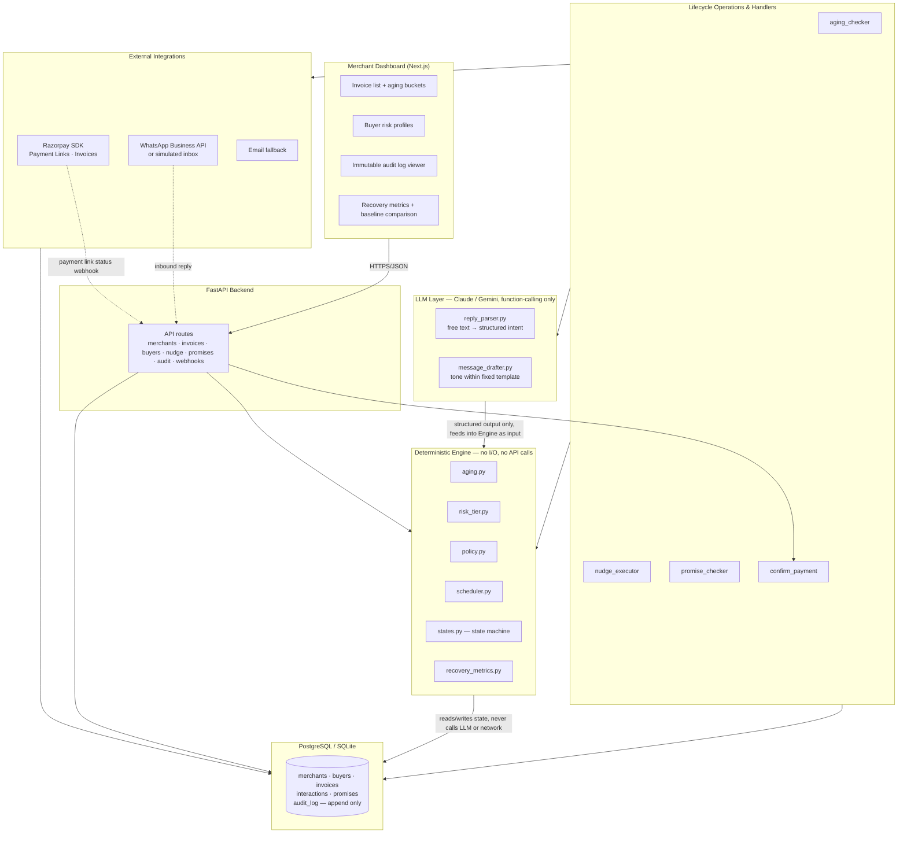
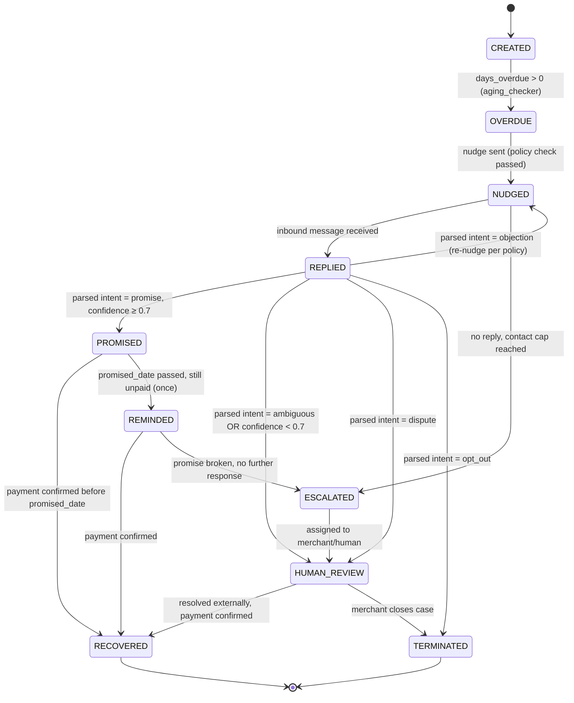
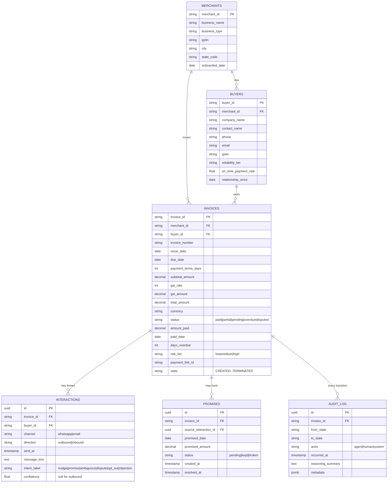
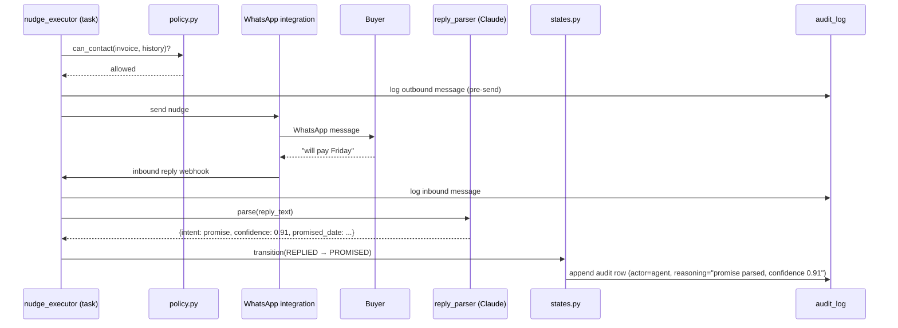
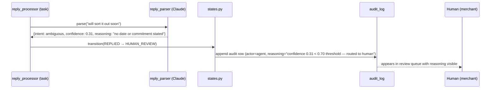

# DueBot — System Architecture

**An AI collections agent for overdue B2B receivables, built on Razorpay's Invoices and Payment Links APIs.**
Track 03 — AI Revenue Recovery · Razorpay AI Buildathon 2026

> This document is the canonical system design reference for DueBot. It is written for two audiences at once: the panel of Razorpay engineers who will read the code and question every choice, and the engineer (you) who has to defend those choices under pressure. Every major decision below is stated with its rationale, not just its shape — because "why" is what gets asked in the interview, not "what."

---

## 1. One-paragraph summary

DueBot watches a merchant's overdue Razorpay invoices, decides when and how to nudge the buyer (WhatsApp-first, escalating tone), extracts and tracks explicit promise-to-pay commitments from free-text buyer replies, and escalates to a human the instant a promise breaks, a dispute surfaces, or the system isn't confident about what it just read. It never moves money — it only requests payment via Razorpay Payment Links. Every state transition is an immutable, explainable, append-only log row. The system is split cleanly into a **deterministic core** (aging, risk, policy, state transitions — plain Python, fully testable, zero API calls) and a thin **LLM periphery** (message tone and free-text reply parsing only). The LLM never decides *whether* to act; it only helps the system understand *what was said* and *how to phrase* a message the deterministic core already decided to send.

---

## 2. Design principles (read this before reading anything else)

These four rules generate almost every other decision in this document. When a reviewer asks "why did you do X," the answer is almost always one of these four.

| # | Principle | What it rules out |
|---|---|---|
| **P1** | **Deterministic core, LLM periphery.** If a decision can be expressed as a rule, it must be a rule — not a prompt. | LLM-driven retry timing, LLM-driven escalation, LLM-driven contact-cap enforcement. |
| **P2** | **State machine over framework.** The invoice lifecycle is a finite, enumerable set of states and transitions. Model it explicitly, not implicitly inside an agent loop. | LangChain/CrewAI/AutoGen, ReAct-style open-ended agent loops for anything money-adjacent. |
| **P3** | **Stopping is a first-class feature.** Abstention, escalation, and rollback are designed with the same care as the happy path — not bolted on. | Silent failure, best-effort guessing, "the agent acted" treated as the only success condition. |
| **P4** | **No component without a reason.** Every piece of infrastructure must answer "what would break without this," not "what's standard." | Message queues, vector DBs, microservices, Kubernetes, Redis, GraphQL — none of these solve a problem this system actually has. |

These map directly onto four core architectural design decisions:
- *"Why is retry/escalation deterministic and not LLM-driven?"* → **P1**. Compliance and predictability matter more than cleverness for money-adjacent actions; the LLM's job is language, not policy.
- *"Why hand-roll a state machine instead of using a framework?"* → **P2**. A transparent, hand-rolled state machine is predictable, debuggable, and provably finite without black-box agent framework overhead.
- *"What happens when the LLM isn't sure?"* → **P3**. It never guesses; it asks a human, with a stated reason.
- *"Why Postgres and not a vector DB / why no queue?"* → **P4**. This is structured state tracking at production-ready scale, not retrieval, and not high enough throughput to need async messaging.

---

## 3. High-level component diagram



**The one arrow that matters most in this diagram:** LLM → Engine is one-directional and passes *data*, not *decisions*. The parser hands the state machine a structured intent (`promise`, `dispute`, `ambiguous`, ...) with a confidence score. The state machine — plain Python, no API call — decides what happens next. If a reviewer asks you to point to the line where "the agent decides to act," it should be a deterministic `if` statement in `engine/policy.py`, never a Claude API response.

---

## 4. The invoice lifecycle state machine

This is the spine of the system. Every other component either produces an input to it or consumes an output from it.



**Transition rules matrix — the implementation-level view of the same diagram above:**

Every valid transition, with its trigger condition and the actor responsible. Any transition not listed here is invalid and must raise `InvalidTransitionError`. This table is the source of truth for `engine/states.py`'s `VALID_TRANSITIONS` dict.

| # | From | To | Trigger | Actor | Guard condition |
|---|------|----|---------|-------|------------------|
| T1 | CREATED | OVERDUE | `due_date < as_of` | system (aging_checker) | `days_overdue(as_of) > 0` |
| T2 | OVERDUE | NUDGED | Nudge sent successfully | agent (nudge_executor) | `can_contact() == allowed` |
| T3 | OVERDUE | RECOVERED | Payment confirmed via webhook | system (Razorpay webhook) | `payment_link.status == paid` |
| T4 | NUDGED | REPLIED | Inbound message received and parsed | agent (reply_processor) | `inbound_message.intent is not None` |
| T5 | NUDGED | ESCALATED | No reply, contact cap hit | system (policy) | `contacts_this_week >= MAX_CONTACTS_PER_WEEK` |
| T6 | NUDGED | RECOVERED | Payment confirmed | system (webhook) | `payment_link.status == paid` |
| T7 | REPLIED | PROMISED | `intent == promise` | agent | `confidence >= 0.7` |
| T8 | REPLIED | DISPUTED | `intent == dispute` | agent | always (disputes are immediate) |
| T9 | REPLIED | HUMAN_REVIEW | `intent == ambiguous` OR `confidence < 0.7` | agent | — |
| T10 | REPLIED | TERMINATED | `intent == opt_out` | agent | opt-out is irreversible |
| T11 | REPLIED | NUDGED | `intent == objection` | agent | re-nudge per policy, still within cap |
| T12 | PROMISED | RECOVERED | Payment confirmed before promised_date | system (webhook) | `payment_date <= promised_date` |
| T13 | PROMISED | REMINDED | `promised_date` passed, still unpaid | system (promise_checker) | once per promise cycle |
| T14 | PROMISED | ESCALATED | Promise broken, no response after reminder | system (promise_checker) | `days_since_promise > 3` |
| T15 | REMINDED | RECOVERED | Payment confirmed | system (webhook) | — |
| T16 | REMINDED | ESCALATED | Promise broken, no further response | system (policy) | `contacts_this_week >= cap` |
| T17 | ESCALATED | HUMAN_REVIEW | Assigned to merchant | system (auto) | — |
| T18 | HUMAN_REVIEW | RECOVERED | Resolved externally, payment confirmed | human + system | — |
| T19 | HUMAN_REVIEW | TERMINATED | Merchant closes case | human | — |

**Invariants that hold at every state (enforced in `engine/states.py`, not in the LLM prompt):**
- A transition fires only from a deterministic condition: elapsed time, a parsed-intent *label* (not the raw LLM text), a policy threshold, or a webhook-confirmed payment. Never directly from an LLM's free-text output.
- Every transition writes exactly one `audit_log` row before it is considered committed. If the audit write fails, the transition is rolled back — logging is not best-effort.
- `HUMAN_REVIEW` is a sink for every form of uncertainty (low confidence, ambiguity, dispute, contradictory signals) — it is one state, not four, so a human working the queue has a single place to look.
- `DISPUTED` invoices route straight to `HUMAN_REVIEW` and are permanently excluded from the nudge scheduler — a disputed invoice is never re-nudged, even automatically, because automated pressure on a disputed invoice is reputationally risky.
- `TERMINATED` via opt-out is irreversible from the system's side — no code path re-enters the nudge cycle for that invoice once opted out.

---

## 5. Data model

The schema below is the production shape of the same entities the synthetic generator (`backend/data/generator.py`) produces for seeding and evaluation — `merchants.csv` / `buyers.csv` / `invoices.csv` map directly onto the first three tables; `messages.csv` maps onto `interactions`, with `promises` and `audit_log` derived from it during ingestion. Keeping these aligned means the eval harness runs against the exact same schema as the live system — no separate "test shape."



**Why this shape, specifically:**
- `interactions.confidence` lives on the row, not just in a log line — it's queryable, so "show me every promise logged below 0.8 confidence" is a real query for both debugging and the eval report, not a grep through logs.
- `promises` is a separate table from `interactions`, not a status flag on the invoice, because one invoice can accumulate a promise-broken → re-promised history, and the recovery metrics need that full sequence, not just the latest state.
- `audit_log` is append-only by application invariant, enforced cryptographically by an unbroken SHA-256 hash chain (`GET /api/audit/verify`) with live tamper detection — DB-level `REVOKE UPDATE, DELETE` is documented for production PostgreSQL multi-tenant hardening.
- `AUDIT_LOG.actor` distinguishes `agent` (deterministic engine), `human` (merchant action), and `system` (webhook-triggered, e.g. payment confirmed) — so the audit trail can answer "did a human or the agent make this call" at a glance.

---

## 6. The deterministic engine (`backend/engine/`)

This package makes **zero network calls**. Every function is pure or reads/writes only through injected repositories, which makes it the highest-coverage, most heavily tested part of the codebase (95%+ target — see §9).

| Module | Responsibility | Sample signature |
|---|---|---|
| `aging.py` | Computes `days_overdue`, buckets invoices (0–30 / 31–60 / 61–90 / 90+) | `def days_overdue(due_date: date, as_of: date) -> int` |
| `risk_tier.py` | Classifies buyer/invoice risk from reliability tier + days overdue | `def risk_tier(reliability: ReliabilityTier, days_overdue: int) -> RiskTier` |
| `policy.py` | Contact-frequency caps, opt-out enforcement, escalation thresholds — the **hard invariants** | `def can_contact(invoice: Invoice, history: list[Interaction]) -> PolicyDecision` |
| `scheduler.py` | Decides *when* the next nudge is due, given state + policy | `def next_action_at(invoice: Invoice) -> datetime \| None` |
| `states.py` | The state machine itself: valid transitions, guards, audit-row construction | `def transition(invoice: Invoice, event: Event) -> Transition` |
| `recovery_metrics.py` | Recovery rate, promise-kept rate, false-escalation rate, baseline comparison | `def recovery_rate(invoices: list[Invoice], as_of: date) -> RecoveryReport` |

**`policy.py` carries the hard invariants — these are checked in code and covered by tests that assert the invariant, not just the happy path:**

```python
MAX_CONTACTS_PER_WEEK = 3          # named constant, never a bare "3" in a conditional

def can_contact(invoice: Invoice, history: list[Interaction]) -> PolicyDecision:
    if invoice.opted_out:
        return PolicyDecision.blocked("buyer opted out — irreversible")
    if invoice.state == "DISPUTED":
        return PolicyDecision.blocked("disputed invoices are never nudged")
    contacts_this_week = count_outbound_in_window(history, days=7)
    if contacts_this_week >= MAX_CONTACTS_PER_WEEK:
        return PolicyDecision.blocked(f"contact cap reached ({MAX_CONTACTS_PER_WEEK}/week)")
    return PolicyDecision.allowed()
```

No code path in `scheduler.py` or the task runners is allowed to send a message without first calling `can_contact`. This is enforced by a lint rule (integrations/whatsapp.py's `send()` requires a `PolicyDecision` object as an argument, not a boolean — you cannot call it without having gone through policy).

---

## 7. The LLM layer (`backend/llm/`) — the only place Claude is called

Two jobs, both language tasks, neither a policy decision:

### 7.1 Reply parsing (`reply_parser.py`)

Turns a buyer's free-text WhatsApp/email reply into a structured intent using Claude's tool-use / function-calling, **never regex on free text**.

```python
REPLY_INTENT_SCHEMA = {
    "name": "extract_reply_intent",
    "description": "Classify a buyer's reply to a payment nudge.",
    "input_schema": {
        "type": "object",
        "properties": {
            "intent": {
                "type": "string",
                "enum": ["promise", "ambiguous", "dispute", "opt_out", "objection"]
            },
            "promised_date": {"type": ["string", "null"], "description": "ISO date, if intent=promise"},
            "promised_amount": {"type": ["number", "null"], "description": "if partial payment promised"},
            "confidence": {"type": "number", "minimum": 0, "maximum": 1},
            "reasoning": {"type": "string", "description": "one sentence, shown to the human reviewer"}
        },
        "required": ["intent", "confidence", "reasoning"]
    }
}
```

**The abstention rule — this is the single most important line of logic in the whole system:**

```python
CONFIDENCE_THRESHOLD = 0.7

def handle_parsed_reply(invoice: Invoice, parsed: ParsedIntent) -> None:
    if parsed.intent == "promise" and parsed.confidence >= CONFIDENCE_THRESHOLD:
        promise_repo.log_promise(invoice, parsed.promised_date, parsed.promised_amount)
        states.transition(invoice, Event.PROMISE_LOGGED)
    else:
        # low confidence, ambiguous, or anything the model itself isn't sure about —
        # never guess. Route to a human, and say why.
        states.transition(invoice, Event.NEEDS_HUMAN, reason=parsed.reasoning)
```

This is the mechanism behind the demo's "wow moment": an ambiguous reply like *"will sort it out soon"* returns `intent=ambiguous, confidence=0.3` — the system doesn't try to force a date out of it, it explains why it's unsure and hands off. That behavior is a direct, testable consequence of this one function, not a special case bolted on for the demo.

### 7.2 Message drafting (`message_drafter.py`)

Personalizes tone **within a fixed template envelope** — the LLM chooses phrasing, never content facts (amount, invoice number, due date are always injected verbatim from the database, never generated). This closes off prompt-injection-via-invoice-data as an attack surface: even if a buyer's company name or a past message contained adversarial text, the numbers a merchant relies on are never LLM-generated.

---

## 8. Sequence: the full nudge → reply → promise loop



And the abstention path, side by side:



---

## 9. Testing & evaluation architecture

Two different kinds of correctness are being proven here, and they're kept separate:

- **Unit/integration tests** prove the code does what it's supposed to (`engine/` 95%+, `llm/` 80%+ with the API mocked, `api/` 85%+). These run in CI on every commit.
- **The eval harness** (`scripts/run_eval.py`) benchmarks the product across a held-out generator dataset (`split=test`, n=71), driving the real deterministic engine (`can_contact`, `transition`, `next_action_at`, `fallback_intent`) day-by-day.

**The eval harness runs three conditions over the exact same held-out test split (n=71)** and reports 30/60/90-day recovery rate, promise-kept rate, false-escalation rate, total contacts, and capital efficiency for each:

1. **No intervention (`no_agent`)** — what recovers with zero follow-up (the self-cure floor).
2. **Naive fixed-cadence reminder (`naive_cadence`)** — a deterministic "nudge every 7 days" baseline without policy or dispute checks.
3. **DueBot** — the actual policy-governed engine with weekly contact caps, promise grace periods, and dispute abstention.

The three-way comparison, not DueBot's numbers in isolation, is the artifact that answers "how do you know this actually helps" — a number without a baseline is a claim; a number next to two baselines is evidence.

---

## 10. Safety architecture (§ this is what "bounded, logged, and reversible" means in code)

**Hard invariants — enforced in `policy.py`, covered by tests that assert them directly, never violated regardless of LLM output:**
1. Max 3 contacts per invoice per week.
2. No contact after explicit opt-out — honored immediately and irreversibly.
3. No discount, waiver, or write-off without human approval.
4. No auto-debit, ever — only Payment Link generation. The buyer always initiates the transfer.
5. Disputed invoices → immediate human escalation, never nudged.
6. Every outbound message is logged **before** send; if the log write fails, the send is aborted.

**Soft guardrails — logged and flagged, not hard blocks:**
- Reply-parsing confidence below 0.7 → human review (§7.1).
- Contradictory signals in one thread (promise followed by dispute) → escalate.
- Contact frequency approaching (not yet at) cap → dashboard warning.

**Idempotency:** every state transition is keyed on `(invoice_id, attempt_number)`. If the process crashes mid-send, the next poll cycle re-verifies any `"sending"`-state row against the messaging provider's delivery status before deciding whether to retry — so a crash never produces a duplicate nudge or a silently lost one.

---

## 11. Why not X — anticipated architecture questions

| Question | Answer |
|---|---|
| Why Postgres, not a vector DB? | This is structured state tracking (invoices, promises, transitions), not a retrieval problem. A vector DB adds infrastructure with no corresponding capability need. |
| Why a hand-rolled state machine, not LangChain/CrewAI? | A framework's agent loop is a black box exactly where this system needs to be most legible — money-adjacent decisions. "I didn't need one, here's the 30-line state machine" is a stronger answer under questioning than naming a framework. |
| Why is retry/escalation timing deterministic and not LLM-driven? | Compliance and predictability outrank cleverness here. The LLM's contribution is understanding language, not setting policy. |
| Why no message queue? | Throughput at this scale (per-invoice events, hackathon-to-early-SME-scale) doesn't require async messaging; a poll loop is simpler, and simpler is more defensible until there's a measured reason to change it. |
| Why does the audit log matter this much? | Because "the agent acted" is not the same as "the agent acted correctly, and we can prove it did." The log is what turns a demo into evidence. |
| How does this scale to Razorpay's actual merchant base? | The architecture is per-invoice event-driven and horizontally scalable; the only real bottleneck is LLM throughput on reply-parsing, which is cheap and fast per message and trivially parallelizable across invoices. |

---

## 12. Deployment

- **Frontend:** Vercel (Next.js).
- **Backend:** Railway or Render (FastAPI + Postgres), or run both locally for the live demo — reliability over infra-flexing on demo day.
- **Environment config:** Pydantic `Settings`, all values from environment variables, documented in `.env.example` — nothing hardcoded, nothing undocumented.

---

## 13. What this document does *not* cover

Deliberately out of scope for v1, to keep the safety surface small and the system legible: fine-tuning (no labeled data exists yet — few-shot prompting with a locked template is more auditable and faster to iterate on), auto-write-off logic, multi-currency support, and any autonomous mandate/auto-debit path. All four are natural "what would you build next" answers, not gaps in the current design.

---

## 14. REST API endpoints

Complete endpoint specification. All responses follow `{"data": ..., "meta": {"timestamp": ..., "request_id": ...}}`. Errors follow `{"error": {"code": ..., "message": ..., "details": ...}}`.

| Method | Path | Purpose | Query params | Request body |
|--------|------|---------|-------------|-------------|
| GET | `/api/merchants` | List merchants | `limit`, `offset` | — |
| POST | `/api/merchants` | Create merchant | — | `{business_name, business_type, gstin, city, state_code}` |
| GET | `/api/merchants/{id}` | Single merchant + buyer count + invoice summary | — | — |
| GET | `/api/invoices` | List invoices (filterable) | `status`, `risk_tier`, `days_overdue_min`, `days_overdue_max`, `merchant_id`, `split`, `limit`, `offset` | — |
| GET | `/api/invoices/{id}` | Single invoice with full timeline + interactions + promises | — | — |
| POST | `/api/invoices/ingest` | Bulk ingest from CSV (maps generator output → DB) | — | CSV file upload |
| GET | `/api/buyers` | List buyers (filterable) | `reliability_tier`, `merchant_id`, `limit`, `offset` | — |
| GET | `/api/buyers/{id}` | Single buyer with payment history + invoice list | — | — |
| POST | `/api/nudge/trigger` | Manually trigger nudge cycle for one invoice (dry-run option) | `dry_run=true/false` | `{invoice_id}` |
| GET | `/api/nudge/preview/{invoice_id}` | Preview what nudge would be sent (never actually sends) | — | — |
| GET | `/api/promises` | List promises (filterable) | `status`, `invoice_id`, `limit`, `offset` | — |
| GET | `/api/promises/{id}` | Single promise with source interaction + resolution | — | — |
| GET | `/api/audit` | Audit log (filterable) | `invoice_id`, `actor`, `from_state`, `to_state`, `date_from`, `date_to`, `limit`, `offset` | — |
| GET | `/api/metrics/recovery` | Recovery rate metrics + baseline comparison | `split` (dev/eval), `as_of` date | — |
| GET | `/api/metrics/baseline` | Naive fixed-cadence baseline comparison | `cadence_days` (default 7) | — |
| GET | `/api/health` | Health check | — | — |

**Implementation notes for the API layer:**
- Every list endpoint returns paginated results with `meta.total_count` for the frontend.
- `/api/invoices/ingest` maps the generator's CSV columns directly: `invoice_number` → `invoices.invoice_number`, `gst_rate` → `invoices.gst_rate`, etc. The mapper is in `backend/data/csv_mapper.py`.
- `/api/nudge/trigger` with `dry_run=true` runs the full pipeline (policy check → LLM draft → audit log) but stops before sending. This is how the demo works.
- `/api/audit` is the primary debugging tool — the eval harness reads it to generate the "reasoning trace" shown in the pitch.

---

## 15. SQL schema — precise column definitions

The ER diagram in §5 shows relationships. This table shows exact types, constraints, and indexes — the implementation reference for Alembic migrations.

### `merchants`

| Column | Type | Constraints | Notes |
|--------|------|------------|-------|
| `merchant_id` | `VARCHAR(20)` | `PRIMARY KEY` | e.g. `MER-001` |
| `business_name` | `VARCHAR(255)` | `NOT NULL` | |
| `business_type` | `VARCHAR(50)` | `NOT NULL` | `services`, `wholesale`, `manufacturing`, `retail_b2b` |
| `gstin` | `VARCHAR(15)` | `NOT NULL, UNIQUE` | Synthetic but valid-form |
| `city` | `VARCHAR(100)` | `NOT NULL` | |
| `state_code` | `VARCHAR(2)` | `NOT NULL` | Indian state code |
| `onboarded_date` | `DATE` | `NOT NULL` | |

### `buyers`

| Column | Type | Constraints | Notes |
|--------|------|------------|-------|
| `buyer_id` | `VARCHAR(30)` | `PRIMARY KEY` | e.g. `MER-001-BUY-0001` |
| `merchant_id` | `VARCHAR(20)` | `NOT NULL, FK → merchants.merchant_id` | |
| `company_name` | `VARCHAR(255)` | `NOT NULL` | |
| `contact_name` | `VARCHAR(255)` | `NOT NULL` | |
| `phone` | `VARCHAR(20)` | `NOT NULL` | |
| `email` | `VARCHAR(255)` | `NOT NULL` | |
| `gstin` | `VARCHAR(15)` | `NOT NULL` | |
| `reliability_tier` | `VARCHAR(20)` | `NOT NULL, CHECK (reliability_tier IN ('reliable', 'occasional_late', 'chronic_late'))` | |
| `on_time_payment_rate` | `REAL` | `NOT NULL, CHECK (0.0 <= rate <= 1.0)` | Computed from payment history |
| `relationship_since` | `DATE` | `NOT NULL` | |

**Index:** `idx_buyers_merchant` on `(merchant_id)`

### `invoices`

| Column | Type | Constraints | Notes |
|--------|------|------------|-------|
| `invoice_id` | `VARCHAR(25)` | `PRIMARY KEY` | e.g. `INV-abc123def0` |
| `merchant_id` | `VARCHAR(20)` | `NOT NULL, FK → merchants.merchant_id` | |
| `buyer_id` | `VARCHAR(30)` | `NOT NULL, FK → buyers.buyer_id` | |
| `invoice_number` | `VARCHAR(50)` | `NOT NULL, UNIQUE` | Merchant's reference |
| `issue_date` | `DATE` | `NOT NULL` | |
| `due_date` | `DATE` | `NOT NULL` | |
| `payment_terms_days` | `INTEGER` | `NOT NULL, CHECK (terms IN (15, 30, 45, 60))` | |
| `subtotal_amount` | `NUMERIC(12,2)` | `NOT NULL, CHECK (amount > 0)` | Before GST |
| `gst_rate` | `INTEGER` | `NOT NULL, CHECK (rate IN (0, 5, 12, 18, 28))` | GST percentage |
| `gst_amount` | `NUMERIC(12,2)` | `NOT NULL` | `subtotal * gst_rate / 100` |
| `total_amount` | `NUMERIC(12,2)` | `NOT NULL` | `subtotal + gst` |
| `currency` | `VARCHAR(3)` | `NOT NULL DEFAULT 'INR'` | |
| `status` | `VARCHAR(20)` | `NOT NULL, CHECK (status IN ('paid', 'partial', 'pending', 'overdue', 'disputed'))` | Generator status |
| `amount_paid` | `NUMERIC(12,2)` | `NOT NULL DEFAULT 0` | |
| `paid_date` | `DATE` | `NULLABLE` | |
| `days_overdue` | `INTEGER` | `NOT NULL DEFAULT 0, CHECK (days >= 0)` | Computed, updated by aging_checker |
| `risk_tier` | `VARCHAR(10)` | `NOT NULL, CHECK (risk IN ('low', 'medium', 'high'))` | |
| `payment_link_id` | `VARCHAR(30)` | `NULLABLE` | Razorpay test-mode payment link |
| `state` | `VARCHAR(20)` | `NOT NULL DEFAULT 'CREATED'` | State machine state (see §4) |
| `opted_out` | `BOOLEAN` | `NOT NULL DEFAULT FALSE` | Hard block on contact |
| `edge_case` | `VARCHAR(30)` | `NOT NULL DEFAULT 'none'` | From generator |
| `would_have_paid_without_intervention` | `BOOLEAN` | `NULLABLE` | Ground truth label |
| `promise_outcome` | `VARCHAR(10)` | `NOT NULL DEFAULT 'none'` | `none | pending | kept | broken` |
| `split` | `VARCHAR(10)` | `NOT NULL, CHECK (split IN ('train', 'test'))` | 70/30 dev/eval |
| `notes` | `TEXT` | `NULLABLE` | Edge case descriptions |
| `created_at` | `TIMESTAMPTZ` | `NOT NULL DEFAULT NOW()` | |
| `updated_at` | `TIMESTAMPTZ` | `NOT NULL DEFAULT NOW()` | |

**Indexes:**
- `idx_invoices_merchant` on `(merchant_id)`
- `idx_invoices_buyer` on `(buyer_id)`
- `idx_invoices_status` on `(status)`
- `idx_invoices_state` on `(state)` — critical for the aging_checker and scheduler queries
- `idx_invoices_overdue` on `(days_overdue)` WHERE `state NOT IN ('RECOVERED', 'TERMINATED')` — partial index for the nudge queue

### `interactions`

| Column | Type | Constraints | Notes |
|--------|------|------------|-------|
| `id` | `UUID` | `PRIMARY KEY DEFAULT gen_random_uuid()` | |
| `invoice_id` | `VARCHAR(25)` | `NOT NULL, FK → invoices.invoice_id` | |
| `buyer_id` | `VARCHAR(30)` | `NOT NULL, FK → buyers.buyer_id` | Denormalized for query speed |
| `channel` | `VARCHAR(10)` | `NOT NULL, CHECK (channel IN ('whatsapp', 'email'))` | |
| `direction` | `VARCHAR(10)` | `NOT NULL, CHECK (direction IN ('outbound', 'inbound'))` | |
| `sent_at` | `TIMESTAMPTZ` | `NOT NULL` | |
| `message_text` | `TEXT` | `NOT NULL` | |
| `intent_label` | `VARCHAR(20)` | `NOT NULL` | `nudge`, `promise`, `ambiguous`, `dispute`, `opt_out`, `objection` |
| `confidence` | `REAL` | `NULLABLE, CHECK (0.0 <= confidence <= 1.0)` | `NULL` for outbound messages; populated by reply_parser for inbound |
| `delivery_status` | `VARCHAR(20)` | `NOT NULL DEFAULT 'pending'` | `pending | sent | delivered | failed` |
| `created_at` | `TIMESTAMPTZ` | `NOT NULL DEFAULT NOW()` | |

**Indexes:**
- `idx_interactions_invoice` on `(invoice_id)`
- `idx_interactions_buyer` on `(buyer_id)`
- `idx_interactions_low_confidence` on `(confidence)` WHERE `confidence IS NOT NULL AND confidence < 0.7` — for the eval harness query: "show me every promise logged below threshold"

### `promises`

| Column | Type | Constraints | Notes |
|--------|------|------------|-------|
| `id` | `UUID` | `PRIMARY KEY DEFAULT gen_random_uuid()` | |
| `invoice_id` | `VARCHAR(25)` | `NOT NULL, FK → invoices.invoice_id` | |
| `source_interaction_id` | `UUID` | `NOT NULL, FK → interactions.id` | The reply that produced this promise |
| `promised_date` | `DATE` | `NOT NULL` | |
| `promised_amount` | `NUMERIC(12,2)` | `NULLABLE` | `NULL` = full amount promised |
| `confidence` | `REAL` | `NOT NULL, CHECK (confidence >= 0.7)` | Only high-confidence promises are logged |
| `status` | `VARCHAR(10)` | `NOT NULL, CHECK (status IN ('pending', 'kept', 'broken'))` | |
| `created_at` | `TIMESTAMPTZ` | `NOT NULL DEFAULT NOW()` | |
| `resolved_at` | `TIMESTAMPTZ` | `NULLABLE` | Set when status → kept or broken |

**Index:** `idx_promises_invoice` on `(invoice_id)`

### `audit_log`

| Column | Type | Constraints | Notes |
|--------|------|------------|-------|
| `id` | `UUID` | `PRIMARY KEY DEFAULT gen_random_uuid()` | |
| `invoice_id` | `VARCHAR(25)` | `NOT NULL, FK → invoices.invoice_id` | |
| `from_state` | `VARCHAR(20)` | `NOT NULL` | Previous state machine state |
| `to_state` | `VARCHAR(20)` | `NOT NULL` | New state machine state |
| `actor` | `VARCHAR(20)` | `NOT NULL, CHECK (actor IN ('agent', 'human', 'system'))` | |
| `occurred_at` | `TIMESTAMPTZ` | `NOT NULL DEFAULT NOW()` | |
| `reasoning_summary` | `TEXT` | `NOT NULL` | Human-readable explanation |
| `metadata` | `JSONB` | `NULLABLE` | LLM confidence, raw input, etc. |

**Constraints:**
- **No UPDATE or DELETE** — enforced by application architecture (zero update/delete pathways) and mathematically guaranteed by the SHA-256 cryptographic hash chain (`GET /api/audit/verify`). In production PostgreSQL deployments, `REVOKE UPDATE, DELETE ON audit_log FROM app_role;` is applied as an additional defence-in-depth permission layer.
- **Index:** `idx_audit_invoice` on `(invoice_id)` — for the timeline view on the frontend

### `baseline_comparison`

| Column | Type | Constraints | Notes |
|--------|------|------------|-------|
| `id` | `UUID` | `PRIMARY KEY DEFAULT gen_random_uuid()` | |
| `run_id` | `UUID` | `NOT NULL` | Groups a single three-way comparison run |
| `strategy` | `VARCHAR(30)` | `NOT NULL, CHECK (strategy IN ('no_agent', 'naive_cadence', 'duebot'))` | |
| `eval_set_size` | `INTEGER` | `NOT NULL` | Number of invoices in the held-out batch |
| `recovered_count` | `INTEGER` | `NOT NULL` | |
| `recovered_value` | `NUMERIC(12,2)` | `NOT NULL` | |
| `total_value` | `NUMERIC(12,2)` | `NOT NULL` | |
| `avg_days_to_recovery` | `REAL` | `NOT NULL` | |
| `recovery_30d` | `REAL` | `NOT NULL` | % of value recovered within 30 days |
| `recovery_60d` | `REAL` | `NOT NULL` | |
| `recovery_90d` | `REAL` | `NOT NULL` | |
| `total_contacts_sent` | `INTEGER` | `NOT NULL` | |
| `created_at` | `TIMESTAMPTZ` | `NOT NULL DEFAULT NOW()` | |

**Index:** `idx_baseline_run` on `(run_id)` — for fetching a single comparison set
