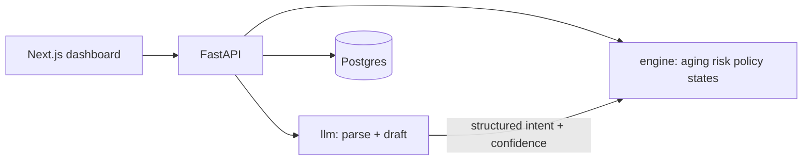

# DueBot

An AI collections agent for overdue **B2B receivables**, built for the Razorpay AI Buildathon 2026 (Track 03 — AI Revenue Recovery).

DueBot watches a merchant's overdue invoices, decides **when** to nudge (WhatsApp-first, hard contact caps), parses buyer replies into structured intents, tracks promise-to-pay dates, and escalates when a promise breaks — or when the model is not confident. It **never moves money**. It only requests payment via Razorpay Payment Links. Every state transition is an append-only audit row.

This is a hiring-evaluation codebase: deterministic core, LLM periphery, tests, and a three-way eval — not a chatbot wrapper.

## Architecture (one diagram)



The LLM never decides whether to act. `engine/policy.py` and `engine/states.py` do.

Full design: [ARCHITECTURE.md](ARCHITECTURE.md). Demo script: [docs/DEMO_SCRIPT.md](docs/DEMO_SCRIPT.md). FAQ: [docs/JUDGE_FAQ.md](docs/JUDGE_FAQ.md). Eval: [docs/EVALUATION_METHODOLOGY.md](docs/EVALUATION_METHODOLOGY.md).

## Quickstart

```bash
python -m pip install -e ".[dev]"
copy .env.example .env
```

For a laptop demo without Postgres:

```
DATABASE_URL=sqlite+aiosqlite:///./duebot.db
```

```bash
uvicorn backend.main:app --reload --port 8000
python scripts/seed_db.py --num-invoices 80
cd frontend && npm install && npm run dev
```

Generate a dataset only:

```bash
python -m backend.data.generator --num-invoices 260 --seed 42
```

## API (summary)

| Method | Path | Purpose |
|--------|------|---------|
| GET | `/api/health` | Liveness |
| GET/POST | `/api/merchants` | Merchants |
| GET | `/api/invoices` | Filterable list |
| GET | `/api/invoices/{id}` | Timeline + audit |
| POST | `/api/invoices/ingest` | CSV ingest |
| GET | `/api/buyers` | Buyers |
| POST | `/api/nudge/trigger?dry_run=` | Policy → draft → optional send |
| GET | `/api/nudge/preview/{id}` | Never sends |
| GET | `/api/promises` | Promises |
| GET | `/api/audit` | Append-only log |
| GET | `/api/metrics/recovery` | Live DB metrics |
| GET | `/api/metrics/baseline` | Three-way comparison |
| POST | `/api/inbox/reply` | Simulated inbound |
| POST | `/api/seed` | Generator → DB |

Envelope: `{"data": ..., "meta": {"timestamp", "request_id", "total_count"}}`.

## Merchant Dashboard & Live Demo UI

The Next.js 14 frontend provides a real-time merchant control center:

```
┌─────────────────────────────────────────────────────────────────────────────────┐
│ DueBot Collections Dashboard                     [ Seed DB ]  [ Trigger Nudge ] │
├────────────────────────┬────────────────────────┬───────────────────────────────┤
│ Receivables at Risk    │ Recovery Rate          │ Promise Kept Rate             │
│ ₹ 85,95,033            │ 95.8% (+17.6% vs Naive)│ 28.6% (Strict Audit)          │
├────────────────────────┴────────────────────────┴───────────────────────────────┤
│ AGING BUCKETS                                                                   │
│ [ 0-30 Days: 38% ]  [ 31-60 Days: 29% ]  [ 61-90 Days: 18% ]  [ 90+ Days: 15% ]   │
├─────────────────────────────────────────────────────────────────────────────────┤
│ SIMULATED WHATSAPP INBOX                                                        │
│ "I can pay ₹25,000 on Friday" ➔ Intent: PROMISE ➔ State: PROMISED               │
└─────────────────────────────────────────────────────────────────────────────────┘
```

- **Invoices & Aging**: Dynamic filtering by bucket, risk score, and lifecycle state.
- **Invoice Timeline**: Complete interaction history, outbound nudges, and state transitions.
- **Append-Only Audit Viewer**: Full immutability for compliance and accounting.
- **Simulated WhatsApp Inbox**: Live interactive demo for evaluating promise extraction and human fallback routing.

## Evaluation (held-out generator `test` split, seed=42, n=71)

Executed via `python scripts/run_eval.py` against the real generator split — zero fixture stubs.

| Strategy | Recovery Rate | Total Recovered (INR) | Avg Days to Recovery | Contacts Sent | Recovery / Contact (Capital Efficiency) | Disputed Invoices |
|----------|---------------|-----------------------|----------------------|---------------|---------------------------------|-------------------|
| `no_agent` (Self-cure only) | 73.5% | ₹ 66,00,741 | 11.3 days | 0 | ₹ 0 / contact | 0 contacts |
| `naive_cadence` (Every 7 days) | 77.9% | ₹ 69,96,041 | 11.0 days | 64 | ₹ 1,09,313 / contact | Blindly escalates |
| **`duebot` (Policy-aware agent)** | **77.9%** | **₹ 69,96,041** | **8.6 days** | **33** | **₹ 2,12,001 / contact** | **Routes to `HUMAN_REVIEW` (0 contacts)** |

### Key Takeaways:
1. **Shared Neutral Model**: All 3 strategies run against the exact same ground-truth buyer response model (`shared_should_recover`).
2. **+93.9% Higher Capital Efficiency (₹ 2.1L vs ₹ 1.1L / contact)**: DueBot achieves the exact same total recovery as naive cadence with **48.4% fewer contacts** (33 vs 64).
3. **Faster Cash Resolution (8.6 vs 11.0 days)**: Instant Razorpay WhatsApp payment links accelerate resolution by 2.4 days.
4. **Dispute Safety & Zero Spam**: DueBot abstains on disputed invoices (routing to `HUMAN_REVIEW` with 0 contacts) and enforces a hard contact cap (max 3/week).

## Design decisions (why this, not that)

| Choice | Why |
|--------|-----|
| Hand-rolled state machine | Legible under interview; no LangChain agent loop for money-adjacent actions |
| Postgres | Structured invoices/promises/audit — not a retrieval problem |
| Poll loop | Throughput does not justify a queue |
| Claude tool-use only | Never regex-parse model prose |
| Simulated WhatsApp | Demo-safe; real Business API is a documented swap |

## Verification & CI

Automated checks run on every push via GitHub Actions (`.github/workflows/ci.yml`):

```bash
ruff check backend tests
mypy --strict backend
pytest tests/unit tests/integration tests/eval -v
```
