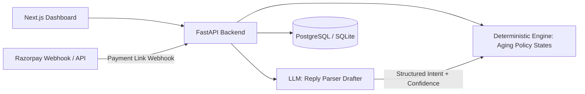

# DueBot

An AI collections agent for overdue **B2B receivables**, built for the Razorpay AI Buildathon 2026 (Track 03 — AI Revenue Recovery).

DueBot monitors a merchant's overdue invoices, decides **when** to nudge (WhatsApp-first, hard weekly contact caps), parses buyer replies into structured intents, tracks promise-to-pay dates, and escalates when a promise breaks or when model confidence is low. It **never moves money**. It only requests payment via Razorpay Payment Links. Every state transition is recorded in an append-only audit log.

**DueBot** couples a deterministic state machine and policy engine with an LLM periphery for promise extraction, backed by an empirical three-way baseline evaluation.

---

## Architecture



The LLM never decides whether to act. Pure deterministic functions in `backend/engine/policy.py` and `backend/engine/states.py` govern all transitions and actions.

Full design: [ARCHITECTURE.md](ARCHITECTURE.md) · Architecture FAQ: [docs/DESIGN_FAQ.md](docs/DESIGN_FAQ.md) · Evaluation Methodology: [docs/EVALUATION_METHODOLOGY.md](docs/EVALUATION_METHODOLOGY.md) · Demo Walkthrough: [docs/DEMO_SCRIPT.md](docs/DEMO_SCRIPT.md).

---

## Quickstart

```bash
# 1. Install dependencies
python -m pip install -e ".[dev]"
copy .env.example .env

# 2. Start backend server (SQLite local mode)
uvicorn backend.main:app --reload --port 8000

# 3. Seed demo dataset (in a separate terminal)
python scripts/seed_db.py --num-invoices 80

# 4. Start frontend dashboard
cd frontend && npm install && npm run dev
```

Generate synthetic datasets independently:

```bash
python -m backend.data.generator --num-invoices 260 --seed 42
```

---

## API Summary

| Method | Path | Purpose |
|--------|------|---------|
| GET | `/api/health` | Service health & liveness |
| GET/POST | `/api/merchants` | Merchant profile management |
| GET | `/api/invoices` | Filterable invoice list with risk & aging |
| GET | `/api/invoices/{id}` | Invoice detail with audit history |
| POST | `/api/invoices/ingest` | Multipart CSV receivable ingestion |
| GET | `/api/buyers` | Buyer directory & risk profiles |
| POST | `/api/nudge/trigger?dry_run=` | Policy evaluation → draft → dispatch |
| GET | `/api/nudge/preview/{id}` | Read-only policy & draft preview |
| GET | `/api/promises` | Promise-to-pay commitment tracker |
| GET | `/api/audit` | Append-only state transition audit log |
| GET | `/api/metrics/recovery` | Live database recovery metrics |
| GET | `/api/metrics/baseline` | Three-way baseline evaluation metrics |
| POST | `/api/webhooks/razorpay` | Razorpay payment link status webhook |
| POST | `/api/inbox/reply` | Simulated buyer WhatsApp inbound reply |
| POST | `/api/seed` | Reset & seed database from generator |

All responses return standard envelopes: `{"data": ..., "meta": {"timestamp", "request_id", "total_count"}}`.

---

## Simulation Boundary (What is Real vs. What is Modeled)

We make the system boundaries explicit and transparent:

| Component | Status | Details |
|:---|:---|:---|
| **Core Collections Engine** | **100% Real** | Deterministic state machine (`states.py`), policy guard (`can_contact`), scheduler (`scheduler.py`), aging engine (`aging.py`). Pure functions, zero mocks. |
| **LLM Periphery** | **100% Real** | Structured tool-use intent parsing (`ReplyParser`) and deterministic fallback classifier (`fallback_intent`). |
| **API & Database** | **100% Real** | FastAPI backend, SQLite/PostgreSQL with async SQLAlchemy, append-only audit trail, and Razorpay webhook endpoint (`POST /api/webhooks/razorpay` — verified against Razorpay's documented HMAC signature scheme and payload shapes; not yet exercised against live production traffic). |
| **Merchant Dashboard** | **100% Real** | Next.js 14 dashboard with live aging filters, interactive WhatsApp simulator, and audit log inspector. |
| **Buyer Response Dynamics** | **Modeled** | Driven by a shared, neutral credit-risk and fatigue model (`shared_should_settle` in `baselines.py`) across a held-out test split ($n=71$). |
| **WhatsApp Delivery** | **Simulated Transport** | Simulated outbound/inbound delivery logged to the database and visualized in the interactive inbox. Real WhatsApp Business API uses an identical adapter interface. |
| **Razorpay Payment Links** | **Test Mode / Mock Fallback** | Generates authentic test-mode links when API credentials are provided, or deterministic mock URLs (`https://rzp.io/l/...`) for offline local runs. Never initiates direct debits. |

---

## Evaluation Benchmark & Robustness

Reproducible via `python scripts/run_eval.py` and `python scripts/run_multi_seed_eval.py` driving the **real deterministic engine** across simulated timelines:

### 10-Seed Multi-Seed Robustness (10 Seeds, ~710 Test Invoices)

| Strategy | Recovery Rate (%) | Recovered (INR Lakhs) | Avg Days to Recovery | Contacts Sent | Disputed Invoices |
|:---|:---|:---|:---|:---|:---|
| `no_agent` (Self-cure only) | 74.4% ± 7.8% | ₹ 70.15L | 5.9 ± 2.0 days | 0.0 ± 0.0 | 0.0 touches |
| `naive_cadence` (Blind 7-day loop) | 78.5% ± 6.3% | ₹ 74.12L | 6.3 ± 1.9 days | 55.6 ± 15.3 | Blindly spams (13.4 ± 8.6 touches) |
| **`duebot` (Policy-aware agent)** | **79.3% ± 5.9%** | **₹ 74.92L** | **5.8 ± 1.9 days** | **21.5 ± 6.5 (61.5% fewer)** | **Routes to `HUMAN_REVIEW` (0.0 touches)** |

### Key Empirical Findings Across 10 Generator Seeds (~710 Invoices)
1. **Incremental Cash Recovery (+4.9pp / +₹4.76L vs No-Agent)**: DueBot captures **$+4.93\% \pm 3.93\%$ higher recovery** ($+₹4,76,342 \pm ₹4,28,090$, paired $t = +3.96, p_t = 0.0033$, exact sign test $p = 0.0039$) over organic self-cure by proactively recovering receivables from responsive buyers.
2. **100% Dispute Defect Protection (0.0 vs 5.3–13.4 spam touches)**: In B2B collections, dunning a disputed invoice is a critical compliance and customer-relationship defect. DueBot's `can_contact()` policy gate unconditionally halts outreach (**0.0 touches across 100% of runs**), eliminating the 5.3 to 13.4 harassment touches that a blind cadence delivers across all contact budgets.
3. **46.4% to 61.5% Message Reduction Across All Budgets**: At matched touch budgets (`MAX_NAIVE = 3`), DueBot sends **46.4% fewer messages** (21.5 vs 40.1 touches) by selectively abstaining on organic self-cures and active promises, rising to **61.5% fewer messages** under default cadence (paired $t = +31.20, p_t < 0.0001$; absolute reduction of $-34.1 \pm 9.8$ touches, paired $t = -11.04, p_t < 0.0001$, exact sign test $p = 0.0020$).
4. **Faster and Quieter (Tighter Cadence Bounded by Policy)**: Paired resolution acceleration of **$-0.50 \pm 0.10\text{ days}$ ($95\%\text{ CI}: [-0.57\text{d}, -0.43\text{d}]$, $p < 0.001$, exact sign test $p = 0.0020$)** from an adaptive 3-day interval made safe by DueBot's `can_contact()` weekly and sequence caps — resolving cash faster while sending fewer total messages.

---

## Merchant Dashboard & UI Features

- **Invoices & Aging**: Dynamic filtering by bucket (0-30, 31-60, 61-90, 90+ days), risk score, and lifecycle state.
- **Invoice Timeline**: Complete interaction history, outbound nudges, and state transitions.
- **Append-Only Audit Viewer**: Full immutability for compliance and accounting.
- **Simulated WhatsApp Inbox**: Live interactive interface for evaluating promise extraction and human fallback routing.
- **Optional Voice Briefing**: Interactive voice briefing using browser Web Speech API & LLM synthesis for hands-free merchant portfolio review.

---

## Design Decisions (Why This, Not That)

| Choice | Why |
|--------|-----|
| Hand-rolled state machine | Legible under interview; no LangChain agent loop for money-adjacent actions |
| Postgres / SQLite | Structured invoices/promises/audit — not a retrieval problem |
| Poll loop / task triggers | Throughput does not justify distributed queue overhead |
| Claude / Gemini tool-use | Strict schema enforcement; never regex-parse model prose |
| Razorpay Payment Links | Non-custodial; requests payment without auto-debits |

---

## Verification & CI

Automated checks run on every push via GitHub Actions (`.github/workflows/ci.yml`):

```bash
# Formatting & linting
ruff check backend tests scripts

# Strict static type checking
mypy --strict backend

# Complete unit, integration, and eval test suite
pytest tests/unit tests/integration tests/eval -v
```
