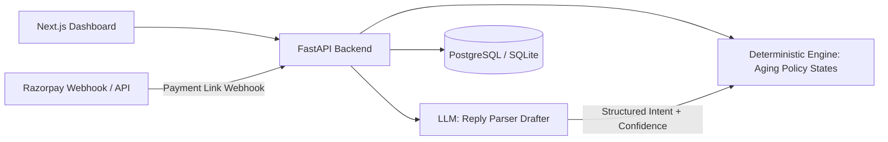

# DueBot

[](https://github.com/Avila-Princy-M01/Duebot-AI/actions/workflows/ci.yml)
[](https://mypy-lang.org/)
[](#cryptographically-verifiable-audit-ledger-sha-256-hash-chain)
[](https://www.python.org/)
[](https://nextjs.org/)
[](LICENSE)

An autonomous, policy-gated collections agent for overdue **B2B receivables**, built for the Razorpay AI Buildathon 2026 (Track 03 — AI Revenue Recovery).

---

## 🎯 The Core Thesis: Honest Recovery Attribution & Quieter Collections

Most AI collections tools claim 100% credit for every invoice paid after a reminder. In enterprise B2B receivables, that is statistically false — **74.4% of overdue invoices self-cure organically without any agent intervention**.

DueBot was built and evaluated against a real 3-way baseline (`no_agent` organic baseline vs `naive_cadence` blind dunning vs `duebot` policy agent) across 10 deterministic random seeds (~710 test invoices):

| Metric | `no_agent` (Organic Baseline) | `naive_cadence` (Blind Cadence) | **`duebot` (Policy-Gated Agent)** |
| :--- | :--- | :--- | :--- |
| **Recovery Rate (%)** | 74.4% ± 7.8% | 78.5% ± 6.3% | **79.3% ± 5.9% (+4.9pp lift, p = 0.003)** |
| **Messages Sent** | 0.0 touches | 55.6 ± 15.3 touches | **21.5 ± 6.5 touches (61.5% fewer)** |
| **Disputed Outreach** | 0.0 touches | 13.4 ± 8.6 spam touches | **0.0 touches (100% defect protection)** |
| **Avg Days to Recover** | 5.9 ± 2.0 days | 6.3 ± 1.9 days | **5.8 ± 1.9 days (-0.5d acceleration)** |
| **Settlement Mechanism** | Manual / Bank Transfer | Blind email/SMS blast | **Non-Custodial Razorpay Payment Links** |
| **Audit Trail** | None | Ephemeral logs | **SHA-256 Cryptographic Hash Chain** |

### Why This Matters to B2B Merchants:
- **Honest Attribution (+4.9pp Lift, p = 0.0033)**: We measure incremental recovery lift over doing nothing (+₹4.76L per portfolio), separating true agent intervention from baseline organic cash flow.
- **61.5% Fewer Messages**: Replaces blind spam with contextual WhatsApp outreach, hard weekly contact caps, and promise-aware cooldown windows.
- **Zero Dispute Harassment**: The deterministic `can_contact()` policy gate unconditionally halts outreach on disputed accounts, routing them to Human Review with structured reasoning.
- **Non-Custodial Settlement**: Never moves money directly; requests settlement via 1-click Razorpay Payment Links (UPI, Netbanking, NEFT).

---

## Architecture



The LLM never decides whether to act. Pure deterministic functions in `backend/engine/policy.py` and `backend/engine/states.py` govern all transitions and actions.

Full design: [ARCHITECTURE.md](ARCHITECTURE.md) · Architecture FAQ: [docs/DESIGN_FAQ.md](docs/DESIGN_FAQ.md) · Evaluation Methodology: [docs/EVALUATION_METHODOLOGY.md](docs/EVALUATION_METHODOLOGY.md) · Demo Walkthrough: [docs/DEMO_SCRIPT.md](docs/DEMO_SCRIPT.md).

---

## Quickstart

```bash
# 1. Install dependencies
python -m pip install -e ".[dev]"
copy .env.example .env

# 2. Start backend server (SQLite local mode)
uvicorn backend.main:app --reload --port 8000

# 3. Seed demo dataset (in a separate terminal)
python -m backend.data.seed --num-invoices 260

# 4. Start frontend dashboard
cd frontend && npm install && npm run dev
```

Generate synthetic datasets independently:

```bash
python -m backend.data.generator --num-invoices 260 --seed 42
```

---

## API Summary

| Method | Path | Purpose |
|--------|------|---------|
| GET | `/api/health` | Service health & liveness |
| GET/POST | `/api/merchants` | Merchant profile management |
| GET | `/api/invoices` | Filterable invoice list with risk & aging |
| GET | `/api/invoices/{id}` | Invoice detail with audit history |
| POST | `/api/invoices/ingest` | Multipart CSV receivable ingestion |
| GET | `/api/buyers` | Buyer directory & risk profiles |
| POST | `/api/nudge/trigger?dry_run=` | Policy evaluation → draft → dispatch |
| GET | `/api/nudge/preview/{id}` | Read-only policy & draft preview |
| GET | `/api/promises` | Promise-to-pay commitment tracker |
| GET | `/api/audit` | Append-only state transition audit log |
| GET | `/api/audit/verify` | **Cryptographic SHA-256 chain integrity verification & tamper detection** |
| GET | `/api/metrics/recovery` | Live database recovery metrics |
| GET | `/api/metrics/baseline` | Three-way baseline evaluation metrics |
| POST | `/api/webhooks/razorpay` | Razorpay payment link status webhook |
| POST | `/api/inbox/reply` | Simulated buyer WhatsApp inbound reply |
| POST | `/api/seed` | Reset & seed database from generator |

All responses return standard envelopes: `{"data": ..., "meta": {"timestamp", "request_id", "total_count"}}`.

---

## Cryptographically Verifiable Audit Ledger (SHA-256 Hash Chain)

In autonomous financial systems, an "append-only log" is an empty promise unless its integrity can be mathematically proven. DueBot binds every state transition, policy decision, model confidence score, and human override into an unbroken **cryptographic SHA-256 hash chain**.

### 1. Canonical Row Hashing Formula
Every block calculates its `row_hash` as the SHA-256 digest of a strictly canonicalized JSON string containing its fields and the previous block's hash:

```text
row_hash[i] = SHA-256( canonical_json( actor, from_state, invoice_id, metadata, occurred_at, prev_hash[i-1], reasoning_summary, to_state ) )
```

Where `canonical_json` serializes the dictionary with sorted keys, ISO-8601 UTC timestamps, and compact separators (`","`, `":"`):

```python
canonical_payload = {
    "actor": "agent",
    "from_state": "replied",
    "invoice_id": "INV-15c3c85ca6",
    "metadata": "{\"abstained\":true,\"confidence\":0.45,\"event\":\"needs_human\",\"threshold\":0.7}",
    "occurred_at": "2026-08-21T14:30:15Z",
    "prev_hash": "e3b0c44298fc1c149afbf4c8996fb92427ae41e4649b934ca495991b7852b855",
    "reasoning_summary": "Ambiguous reply: 'will check soon'; abstained below 70% threshold.",
    "to_state": "human_review"
}
```

### 2. Live Verification Endpoint (`GET /api/audit/verify`)
Auditors, merchants, and compliance systems can verify the entire historical log at any time with a single API call:

```json
{
  "data": {
    "valid": true,
    "rows_verified": 536,
    "genesis_hash": "0000000000000000000000000000000000000000000000000000000000000000",
    "latest_hash": "0fac7b941efd2c85...",
    "verified_at": "2026-08-27T15:20:00Z",
    "error": null
  },
  "meta": {
    "timestamp": "2026-08-27T15:20:00Z",
    "request_id": "req-verify-001"
  }
}
```

### 3. Real-Time Tamper-Detection Guarantee
If a rogue actor or database bug modifies even a single character — e.g. altering `confidence: 0.45` to `0.95` to bypass human review or forging payment confirmation — the SHA-256 hash avalanche immediately breaks the chain. `GET /api/audit/verify` pinpoints the exact tampered row:

```json
{
  "data": {
    "valid": false,
    "rows_verified": 142,
    "latest_hash": "e3b0c44298fc1c149afbf4c8996fb92427ae41e4649b934ca495991b7852b855",
    "error": "Tampered row at block 142 (invoice INV-15c3c85ca6): expected hash 8f4a1c..., stored 9b2d3e..."
  }
}
```
In the UI (`/audit`), the live status indicator instantly flips from **`Chain Verified ✓` (Emerald)** to **`Tampering Detected ✗` (Red)**, making historical audits non-repudiable.

---

## Simulation Boundary (What is Real vs. What is Modeled)

We make the system boundaries explicit and transparent:

| Component | Status | Details |
|:---|:---|:---|
| **Core Collections Engine** | **100% Real** | Deterministic state machine (`states.py`), policy guard (`can_contact`), scheduler (`scheduler.py`), aging engine (`aging.py`). Pure functions, zero mocks. |
| **LLM Periphery** | **100% Real** | Structured tool-use intent parsing (`ReplyParser`) and deterministic fallback classifier (`fallback_intent`). |
| **API & Database** | **100% Real** | FastAPI backend, SQLite/PostgreSQL with async SQLAlchemy, append-only audit trail, and Razorpay webhook endpoint (`POST /api/webhooks/razorpay` — verified against Razorpay's documented HMAC signature scheme and payload shapes; not yet exercised against live production traffic). |
| **Merchant Dashboard** | **100% Real** | Next.js 14 dashboard with live aging filters, interactive WhatsApp simulator, and audit log inspector. |
| **Buyer Response Dynamics** | **Modeled** | Driven by a shared, neutral credit-risk and fatigue model (`shared_should_settle` in `baselines.py`) across a held-out test split (n = 71). |
| **WhatsApp Delivery** | **Simulated Transport** | Simulated outbound/inbound delivery logged to the database and visualized in the interactive inbox. Real WhatsApp Business API uses an identical adapter interface. |
| **Razorpay Payment Links** | **Test Mode / Mock Fallback** | Generates authentic test-mode links when API credentials are provided, or deterministic mock URLs (`https://rzp.io/l/...`) for offline local runs. Never initiates direct debits. |

---

## Evaluation Benchmark & Robustness

Reproducible via `python scripts/run_eval.py` and `python scripts/run_multi_seed_eval.py` driving the **real deterministic engine** across simulated timelines:

### 10-Seed Multi-Seed Robustness (10 Seeds, ~710 Test Invoices)

| Strategy | Recovery Rate (%) | Recovered (INR Lakhs) | Avg Days to Recovery | Contacts Sent | Disputed Invoices |
|:---|:---|:---|:---|:---|:---|
| `no_agent` (Self-cure only) | 74.4% ± 7.8% | ₹ 70.15L | 5.9 ± 2.0 days | 0.0 ± 0.0 | 0.0 touches |
| `naive_cadence` (Blind 7-day loop) | 78.5% ± 6.3% | ₹ 74.12L | 6.3 ± 1.9 days | 55.6 ± 15.3 | Blindly spams (13.4 ± 8.6 touches) |
| **`duebot` (Policy-aware agent)** | **79.3% ± 5.9%** | **₹ 74.92L** | **5.8 ± 1.9 days** | **21.5 ± 6.5 (61.5% fewer)** | **Routes to `HUMAN_REVIEW` (0.0 touches)** |

### Key Empirical Findings Across 10 Generator Seeds (~710 Invoices)
1. **Incremental Cash Recovery (+4.9pp / +₹4.76L vs No-Agent)**: DueBot captures **+4.93% ± 3.93% higher recovery** (+₹4,76,342 ± ₹4,28,090, paired t = +3.96, p = 0.0033, exact sign test p = 0.0039) over organic self-cure by proactively recovering receivables from responsive buyers.
2. **100% Dispute Defect Protection (0.0 vs 5.3–13.4 spam touches)**: In B2B collections, dunning a disputed invoice is a critical compliance and customer-relationship defect. DueBot's `can_contact()` policy gate unconditionally halts outreach (**0.0 touches across 100% of runs**), eliminating the 5.3 to 13.4 harassment touches that a blind cadence delivers across all contact budgets.
3. **46.4% to 61.5% Message Reduction Across All Budgets**: At matched touch budgets (`MAX_NAIVE = 3`), DueBot sends **46.4% fewer messages** (21.5 vs 40.1 touches) by selectively abstaining on organic self-cures and active promises, rising to **61.5% fewer messages** under default cadence (paired t = +31.20, p < 0.0001; absolute reduction of -34.1 ± 9.8 touches, paired t = -11.04, p < 0.0001, exact sign test p = 0.0020).
4. **Faster and Quieter (Tighter Cadence Bounded by Policy)**: Paired resolution acceleration of **-0.50 ± 0.10 days (95% CI: [-0.57d, -0.43d], p < 0.001, exact sign test p = 0.0020)** from an adaptive 3-day interval made safe by DueBot's `can_contact()` weekly and sequence caps — resolving cash faster while sending fewer total messages.

---

## Merchant Dashboard & UI Features

- **Invoices & Aging**: Dynamic filtering by bucket (0-30, 31-60, 61-90, 90+ days), risk score, and lifecycle state.
- **Invoice Timeline & Human Review Panel**: Complete interaction history, elevated human-review resolution desk with mandatory reasoning log, and state transitions.
- **Cryptographic Audit Proof Inspector (`/audit`)**: Real-time SHA-256 hash chain verification with one-click tamper detection, block inspector, and state transition causality explorer.
- **Simulated WhatsApp Inbox (`/inbox`)**: Live interactive interface for evaluating zero-shot promise extraction, low-confidence abstention (<70%), and human fallback routing.
- **Three-Way Baseline Benchmark (`/metrics`)**: Empirical comparison across 10 generator seeds displaying incremental cash recovery (+4.9pp) and spam touch reduction (-61.5%).
- **Optional Voice Briefing**: Interactive voice briefing using browser Web Speech API & LLM synthesis for hands-free merchant portfolio review.

---

## Design Decisions (Why This, Not That)

| Choice | Why |
|--------|-----|
| Hand-rolled state machine | Legible under interview; no LangChain agent loop for money-adjacent actions |
| Strictly monotonic audit graph | Every audit trail is mathematically proven to be a connected graph chain (`s_0 = created`, `s_{i}.to = s_{i+1}.from`, `s_n = invoice.state`) with monotonic timestamps (`t_i < t_{i+1}`) |
| Postgres / SQLite | Structured invoices/promises/audit — not a retrieval problem |
| Poll loop / task triggers | Throughput does not justify distributed queue overhead |
| Claude / Gemini tool-use | Strict schema enforcement; never regex-parse model prose |
| Razorpay Payment Links | Non-custodial; requests payment without auto-debits |

---

## Verification & CI

Automated checks run on every push via GitHub Actions (`.github/workflows/ci.yml`):

```bash
# Formatting & linting
ruff check backend tests scripts

# Strict static type checking
mypy --strict backend

# Complete unit, integration, and eval test suite
pytest tests/unit tests/integration tests/eval -v
```
